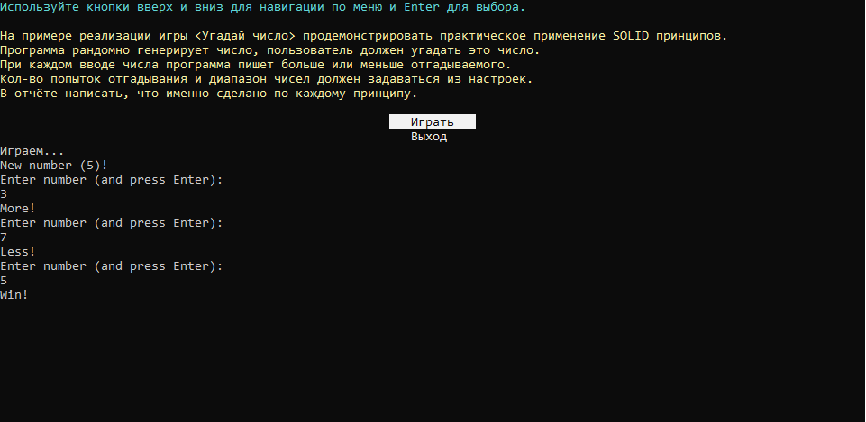

## Принципы SOLID
###### Вебинар от 29.08.23

### Домашнее задание
Демонстрация SOLID принципов

**Цель**:  
Практическое применение SOLID принципов.

**Описание/Пошаговая инструкция выполнения домашнего задания**:
На примере реализации игры «Угадай число» продемонстрировать практическое применение SOLID принципов.  
Программа рандомно генерирует число, пользователь должен угадать это число.  
При каждом вводе числа программа пишет больше или меньше отгадываемого.  
Кол-во попыток отгадывания и диапазон чисел должен задаваться из настроек.  
В отчёте написать, что именно сделано по каждому принципу.  
Приложить ссылку на проект и написать, сколько времени ушло на выполнение задачи.

### Инструкция запуска

1. Склонируйте приложение и зайдите в проект:  
   `git clone https://github.com/antoha-p/otus-hw3-29.08.23.git && cd otus-hw3-29.08.23`
2. Откройте решение и запустите проект:

